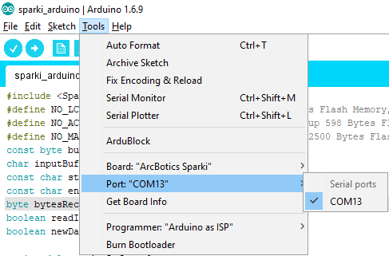
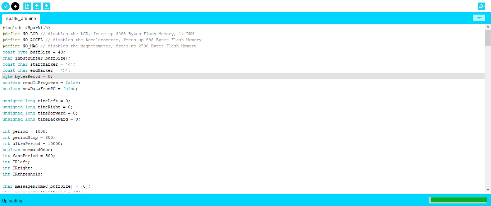

# Dash-Sparki

## Introduction
An application that allows the user to wirelessly control an arduino powered robot known as [Sparki](http://arcbotics.com/products/sparki/). [Play with Sparki here](https://dash-gallery.plotly.host/dash-daq-sparki) and learn more about this application from our [blog entry](https://www.dashdaq.io/control-a-wireless-arduino-robot-in-python). 


### Sparki
Sparki is a pre-built robot, consisting of: an ultrasonic sensor, piezometer, stepper motor, servos, an RGB LED, and a bluetooth module. This robot is built upon a Arduino microcontroller, and is programmed with Sparkiduino, an Arduino based IDE.


### dash-daq
[Dash DAQ](http://dash-daq.netlify.com/#about) is a data acquisition and control package built on top of Plotly's [Dash](https://plot.ly/products/dash/). It gives users more accesibility and, key features for data aquistion applications.


## Requirements
It is advisable	to create a separate virtual environment running Python 3 for the app and install all of the required packages there. To do so, run (any version of Python 3 will work):

```
python3 -m virtualenv [your environment name]
```
```
source activate [your environment name]
```

To install all of the required packages to this environment, simply run:

```
pip install -r requirements.txt
```
 
## How to use the app
There are two versions of this application. A mock version for the user to play with, without any instruments connected, and a local version, that can be connected to a device.

### Local Application
If you would like to run the __**local version**__, first ensure that the following file is uploaded to Sparki using Sparkiduino.

Open the provided file with Sparkiduino,:

```
sparki_arduino.ino
```
and ensure the __**board ArcBotics Sparki**__ and correct port are selected:



next upload the file to Sparki:



If you have issues uploading to Sparki perform a [manual upload](http://arcbotics.com/lessons/manual-upload/).


When the file is uploaded, plug the HC-05 [Bluetooth module](http://arcbotics.com/products/sparki/parts/bluetooth-module/) into Sparki like so:


Now, you can set up the Bluetooth connection bewtween your computer and Sparki, by following the instructions here for [Windows](http://arcbotics.com/products/bluetooth-2-1-module/connecting-your-bluetooth-2-1-module-with-windows-7/), and here for Mac(http://arcbotics.com/products/bluetooth-2-1-module/connecting-your-bluetooth-2-1-module-with-mac-os-x/).

Once you have finished setting up the connection bewteen Sparki and your PC, take the __**serial port path or COM PORT**__ 
and modify it in __**app.py**__:


Run the file in the command line like so:


and you should see this:


Open the web address given to you in your browser and the application will be ready for use:


If the app is run, but the device is not connected you will see something like this:


Sometimes the connection drops with Sparki, if you have issues with connection try the following:
1. Turning the Bluetooth on and off on the PC
2. Pressing the reset button on Sparki
3. Running __**app.py**__

### Mock Application
If you would like to run the __**mock version**__, run in the command line:

```
python app_mock.py 
```


and you should see this:


Open the web address given to you in your browser and the application will be ready for use:


### Controls
* Color Picker: Changes colors of the RGB LED, and the Sparki icon.
* Motion Joystick: Controls the stepper motors in Sparkis wheels, allowing him to move left, right, forwards, and backwards.
* Motion Knob: Controls Sparki's ultrasonic sensor location.
* Gripper Start: Open grippers.
* Gripper Close: Close grippers.
* Gripper Stop: Stop grippers.
* Sweep (Boolean Switch): Puts ultrasonic sensor in sweep mode.
* Sweep: Ultrasonic sensor scans a 180 degree area, and graphs distance of objects every 10 degrees.
* Capture (Boolean Switch): Puts ultrasonic sensor in capture mode.
* Capture: Ultrasonic sensors scans area directly in front of it, and returns distance.
* Detected LED: Green indicates object detected. Red indicated error, or object not detected.
* Beep: Plays a frequency from the piezometer according to the knob frequency.

## Resources
PySerial was used for serial communication, over bluetooth. The API for PySerial can be found [here](http://pyserial.readthedocs.io/en/latest/pyserial_api.html). For programming Sparki, use the Sparkiduino IDE, which also comes with the necessary drivers; you can find the link [here](http://arcbotics.com/lessons/sparkiduino-windows-install-guide/).

## Icon Credit
* [Robot Icon](https://thenounproject.com/search/?q=1275888&i=1275888): Credit goes to Dinosoft Labs, PK for this icon.
